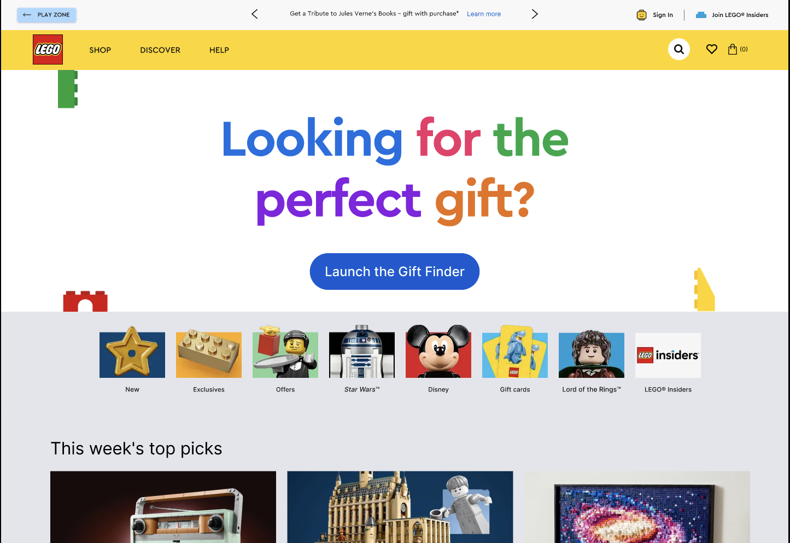

# Team LEts GO

## Introduction

Welcome! This project was developed during a 24-hour hackathon by our team to address the problem: **"How might we assist adults in selecting the right gift for a kid’s birthday?"** Our solution aims to help parents in the process of choosing the perfect LEGO gift for kids of different ages and interests.

## Team

- Madi - Product Manager
- Franco - UX/UI
- Benedikt - Data Science
- Temi - Software Engineering

## Sneak Peek

## Tech Stack

Our application leverages the following technologies:

### Frontend

- React: A JavaScript library for building user interfaces.
- Sass (SCSS): A CSS preprocessor for better styling management.
- JavaScript (ES6+): Programming language for building dynamic web applications.

### Backend (in-build)

Backend still in development. We do have the following technologies in mind

- Node.js: JavaScript runtime built on Chrome's V8 JavaScript engine.
- Express: Web application framework for Node.js.
- MySQL: SQL database for storing user preferences and gift recommendations.

### DevOps

- Git: Version control system for tracking changes and collaboration.
- GitHub: Repository hosting service for collaboration and version control.

### Features

- Children-interaction focused
- User-Friendly Interface: Designed with a focus on usability and aesthetics.
- Personalized Recommendations: Tailored gift suggestions based on the child's age and interests.

## TODOs

A Lotttttt

## Acknowledgements

We would like to thank LEGO GROUP for providing the opportunity to participate in this hackathon and for inspiring us to create this solution. We also extend our gratitude to Brainstation for their support and learning resources.
